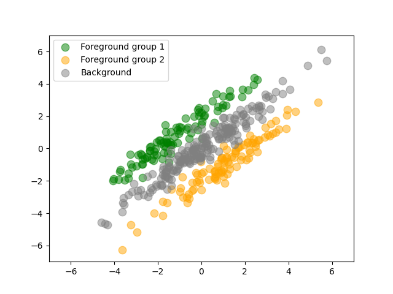

# [Probabilistic contrastive principal component analysis](https://arxiv.org/abs/2012.07977)
[](https://travis-ci.com/github/andrewcharlesjones/pcpca)

This repo contains models and algorithms for probabilistic contrastive principal component analysis (PCPCA). Given a foreground dataset and a backround dataset, PCPCA is designed to find structure and variation that is enriched in the foreground relative to the background.

The accompanying paper can be found here: https://arxiv.org/abs/2012.07977.

## Installation

PCPCA can be installed with pip:
```
pip install pcpca
```

You should then be able to import the model as follows:
```python
from pcpca import PCPCA
```
## Example

Here's a simple example of fitting PCPCA with a toy dataset. In this data, the foreground contains two subgroups. The first half of the foreground samples belong to group 1, and the second half belong to group 2.

Load the toy dataset and plot it:
```python
import pandas as pd
import matplotlib.pyplot as plt

# Load
X = pd.read_csv("./data/toy/foreground.csv", header=None).values
Y = pd.read_csv("./data/toy/background.csv", header=None).values

# Should have same number of features
assert X.shape[0] == Y.shape[0]

p, n = X.shape
m = Y.shape[1]

# Plot
plt.scatter(X[0, :n//2], X[1, :n//2], alpha=0.5, label="Foreground group 1", s=80, color="green")
plt.scatter(X[0, n//2:], X[1, n//2:], alpha=0.5, label="Foreground group 2", s=80, color="orange")
plt.scatter(Y[0, :], Y[1, :], alpha=0.5, label="Background", s=80, color="gray")
plt.legend()
plt.xlim([-7, 7])
plt.ylim([-7, 7])
plt.show()
```

<p align="center">
  
</p>

Now we'll instantiate and fit the model with maximum likelihood estimation.

```python
from pcpca import PCPCA
pcpca = PCPCA(gamma=0.7, n_components=1)
pcpca.fit(X, Y)
```

We can then visualize the line defined by W. (In general, this will be a hyperplane, but here we set n_components=1 for simplicity.)

```python
import numpy as np
def abline(slope, intercept):
    """Plot a line from slope and intercept"""
    axes = plt.gca()
    x_vals = np.array(axes.get_xlim())
    y_vals = intercept + slope * x_vals
    plt.plot(x_vals, y_vals, '--')

# Re-plot data
plt.scatter(X[0, :n//2], X[1, :n//2], alpha=0.5, label="Foreground group 1", s=80, color="green")
plt.scatter(X[0, n//2:], X[1, n//2:], alpha=0.5, label="Foreground group 2", s=80, color="orange")
plt.scatter(Y[0, :], Y[1, :], alpha=0.5, label="Background", s=80, color="gray")
plt.legend()
plt.xlim([-7, 7])
plt.ylim([-7, 7])

# Plot line defined by W
origin = np.array([[0], [0]])  # origin point
abline(slope=pcpca.W_mle[1, 0] / pcpca.W_mle[0, 0], intercept=0)
plt.show()
```

We can see that W finds the axis that splits the two foreground groups:

<p align="center">
  
</p>

Once the model is fit, samples can be projected onto the components by calling `transform`:

```python
X_reduced, Y_reduced = pcpca.transform(X, Y)
```

Or both of these steps can be done with one call to `fit_transform`:

```python
X_reduced, Y_reduced = pcpca.fit_transform(X, Y)
```
